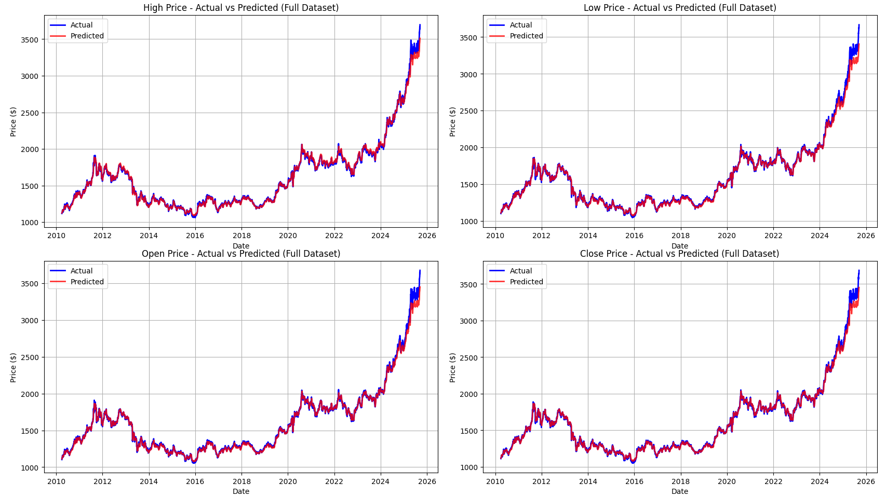

# Gold Price Prediction with LSTM
A deep learning project that uses Long Short-Term Memory (LSTM) neural networks to predict gold prices (High, Low, Open, Close) based on historical data.

# 📊 Features

- Multi-output Prediction: Predicts all four price features (High, Low, Open, Close) simultaneously

- Time Series Analysis: Uses 60 days of historical data to predict the next day's prices

- Flexible Input: Can predict for any specific date in your dataset

- Visualization: Comprehensive plotting of predictions vs actual values

- Error Analysis: Calculates and displays prediction errors for each feature

# ❓ Making Predictions
Run "load_model.py" to load the already trained and saved model "gold_price_lstm_multi_output_model.h5"

Additinially it will:

- Use the previous 60 days of data

- Predict all four price features for the specified date

- Compare predictions with actual values (if available)

- Display results and generate visualizations

# 📋 Requirements
Python 3.7+
tensorflow>=2.0
pandas>=1.0
numpy>=1.18
scikit-learn>=0.22
matplotlib>=3.0

To install all the dependencies, run:
pip install tensorflow pandas numpy scikit-learn matplotlib

# 📈 Plots
The screenshot below demonstrates the predicted values vs actual data.

